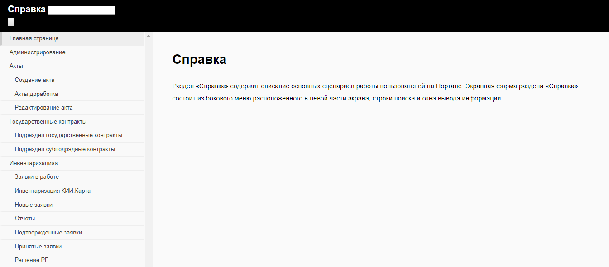
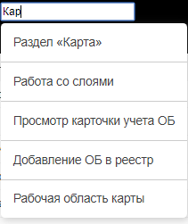

# Главная страница
Раздел «Справка» содержит описание основных сценариев работы пользователей на Портале.
Экранная форма раздела «Справка» состоит из бокового списка разделов, строки поиска и окна вывода информации.

Для вывода справочной информации необходимо кликнуть по пункту бокового меню. Система отобразит сценарий работы в окне вывода информации.

Для поиска необходимой информациии существует текстовый поиск.  

После ввода текста в случае нахождение раздела, содержащего искомую информацию, появиться списк с вариантами как показано ниже.  
