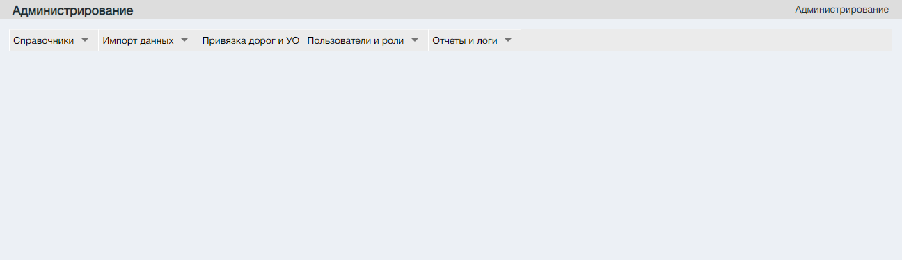
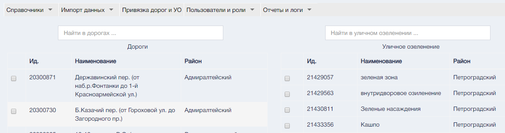
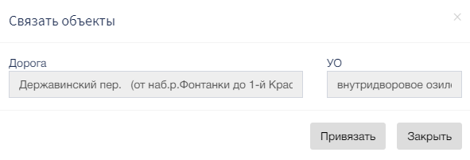

Подсистема предназначена для управления правами доступа к данным Портала и к слоям карты, содержащим геометрию ОБ и ЭБ.
Экранная форма раздела по умолчанию не открывает стартовые страницы
и отображает только подменю раздела.

### Таблицы подразделов

#### Справочники

| Наименование пункта подраздела | Предназначение                        |
|--------------------------------|---------------------------------------|
| Районы.                        | Справочник районов.                   |
| Классификатор ОБ.              | Справочник классификаторов ОБ.        |
| Классификатор ЭБ.              | Справочник классификаторов ЭБ.        |
| Характеристики ОБ и ЭБ.        | Справочник характеристик ОБ и ЭБ.     |
| Слои ГИС.                      | Справочник слоев ГИС.                 |
| Типы ГК.                       | Справочник типов ГК,                  |
| Виды нарушений                 | Справочник видов нарушений.           |
| Подтипы ЭБ.                    | Справочник подтипов ЭБ.               |
| Муниципальные образования.     | Справочник муниципальных образований. |
| Структура связей ОБ и ЭБ.      | Справочник связей ОБ и ЭБ.            |
| История изменений.             | Справочник истории изменений.         |
| Обновить кэш.                  | Обновление кэша.                      |

#### Выгрузка данных

| Наименование пункта подраздела | Предназначение                          |
|--------------------------------|-----------------------------------------|
| Отправить организации в МРМИ.  | Отправить организации в МРМ инспектора. |
| Отправить объектыв МРМИ.       | Отправить объекты в МРМ инспектора.     |

#### Привязка дорог и ОУ

Экранная форма "Привязка дорог и ОУ"

Существует два текстовых поиска дорог и уличного озеленения.

Для установления связи между объектами необходимо выбрать спомощью управляющего элемента 

После чего откроется окно созднаия связи объектов.   
  
Для оздания связи нажмите на управляющий элемент "Привязать".

#### Пользователи и роли

| Наименование пункта подраздела | Предназначение               |
|--------------------------------|------------------------------|
| Пользователи.                  | Справочник пользователей.    |
| Роли.                          | Справочник ролей.            |
| Сессии.                        | Список сессий пользователей. |

#### Отчеты и логи

| Наименование пункта подраздела | Предназначение                                                                       |
|--------------------------------|--------------------------------------------------------------------------------------|
| Лог входов в систему           | Справочник авторизовавшихся пользователей на Порталеза определенный период.          |
| Отчет о работах пользователя   | Справочник действий авторизовавшихся пользователей на Порталеза определенный период. |
