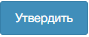

Раздел «Акты» предназначен для ведения актов и включает подразделы: «Редактирование», «Доработка», «Согласование подрядчиком», «Согласование уполномоченной организацией», «Утверждение заказчиком», «Утвержденные».

| №       | Графическое обозначение управляющего элемента | Предназначение                                                                                                                                                    |
|---------|-----------------------------------------------|-------------------------------------------------------------------------------------------------------------------------------------------------------------------|
| 1       |                                | Переход к экранной форме добавления нового акта.                                                                                                                  |
| 2       |                                 | Удаление акта.                                                                                                                                                    |
| 3       |                              | Переход к экранной форме согласования акта.                                                                                                                       |
| 4       |                                 | Переход к экранной форме утверждения акта.                                                                                                                        |
| 5       |                                  | Изменяет количество выводимыхна страницу записейВарианты количества:10, 25, 50.                                                                                   |
| 6       |                                   | Переход на нужную страницу реестра.Одинарная стрелка – переход на следующуюи предыдущую страницы.Двойная стрелка – переход на первуюи последнюю страницы реестра. |
| 7       |                               | Информируето количестве объектови страниц реестрас учетом примененных фильтров.                                                                                   |