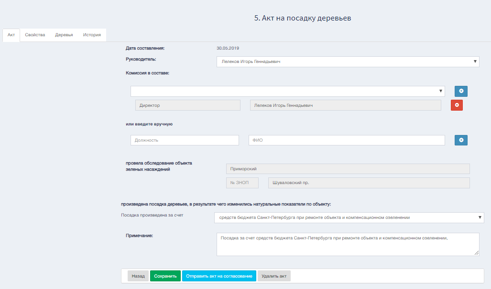

Экранная форма "Редактирование акта" отображена ниже.  

В режиме редактирвания выбрав форму "Акт" будут доступны изменение руководства, состава комиссии, информацию об финансировании и примечание.

Выбрав форму "Свойства" будет отображена таблица содержащая информацию о акте.

Форма "Деревья" отобразит информацию о деревьях, а именно : породу дерева, количество, возраст дерева, тип газона и наличие формовки.

"История" содержит информацию создания и редактирования акта.