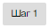

Экранная форма "Акты:Редактирование" представлена ниже 

Для создания акта необходимо нажать на кнопку "Добавить акт"

В последствии чего появиться "Мастер создания актов".

Для перехода
на следующую страницу воспользоваться управляющим элементом «Далее».  
 

 Последующее создание акта производится по шагам:

## ШАГ 1
Представляет из себя заполнение трех обязательных полей представленных ниже.

После ввода значений появиться возможность перехода на следующий шаг. Для этого необходимо нажать клавишу "Шаг 2"  

## ШАГ 2

Шаг 2 представляет из себя заполнение полей таких как "Руководитель" и "Состав комиссии".  

Существует два способа создания Состава комиссии последовательно выбрать из выподающео списка или вручную ввести должность и фамилию.

Для добавления сотрудника в состав комиссии необходимо нажать на кнопку  
 

Для удаления сотрудника из состава комиссии необходимо нажать на кнопку  
 

После внесения всех данных для продолжение нажмите "Шаг 3"  

Если вы хотите вернуться на предыдущий шаг нажмите  "Шаг 1"  

## ШАГ 3

Представляет из себя заполнение обязательных полей представленных ниже.

По завершению всех действий нажмите "Шаг 4"  

## ШАГ 4, ШАГ 5 и ШАГ 6

Выберите нужные показатели, введите значения измерения и добавте управляющим элементом "Добавить" . Если необходимо удалить показатель используйте .

На всех трех шагах существует возможность "Сохранить"  и "Сформировать акт" .

После сохранения акт сохраняет в списке актов.

После сформирования акта, в окне будет выведен результат. Так же будет возможность "Сохранить"  описанная выше и "Отправить акт на соглосование"  после выбора которой акт не будет доступен в режиме редактирования.
