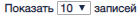

Экранная форма подраздела государственных контрактов.  

#### Управляющие элементы подраздела «Государственные контракты»

| № | Графическое обозначение управляющего элемента | Предназначение                                                                                                                                                        |
|---|-----------------------------------------------|-----------------------------------------------------------------------------------------------------------------------------------------------------------------------|
| 1 |                        | Переход к экранной форме добавления нового государственного контракта.                                                                                                |
| 2 |                              | Переход к экранной форме просмотра государственного контракта.                                                                                                        |
| 3 |                               | Переход к экранной форме редактирования государственного контракта.                                                                                                   |
| 4 |                                  | Переход к экранной форме создания нового государственного контракта. Будут заполнены поля данными скопированного контракта.                                           |
| 5 |                             | Перевод контракта в архив.                                                                                                                                            |
| 6 |                                  | Изменяет количество выводимых на страницу записей. Варианты количества:10, 20, 30, 40.                                                                                |
| 7 |                                   | Переход на нужную страницу реестра. Одинарная стрелка – переход на следующую и предыдущую страницы. Двойная стрелка – переход на первую и последнюю страницы реестра. |

#### Список поисков по столбцам

| №  | Графическое обозначение управляющего элемента | Предназначение                                        |
|----|-----------------------------------------------|-------------------------------------------------------|
| 1  |                                 | Номер интересующего государственного контракта        |
| 2  |                                  | Указание даты создания контракта                      |
| 3  |                        | Дата исполнения контракта                             |
| 4  |                                 | Поиск по цене указанной в контракте                   |
| 5  |                            | Поиск по выполнению в процентах."10" эквивалентно 10% |
| 6  |                                   | Поиск по выбору типу работы                           |
| 7  |                                | Поиск по выбору статуса                               |
| 8  |                               | Поиск по номеру прикрепленных договоров               |
| 9  |                              | Поиск по содержанию описания                          |
| 10 |                              | Поиск по организации исполнителя                      |