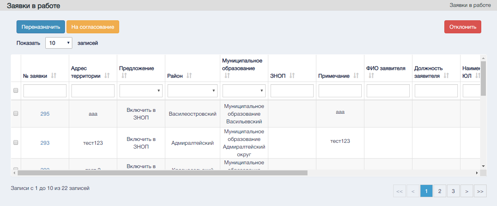

Экранная форма "Заявки в работе".  

Управляющие элементы раздела "Заявки в работе".

В шапке таблицы существуют текстовые поля для поиска и сортировки по отдельный столбцам, а так же выделение всех заявок.

#### Управляющие эелменты

| №      | Графическое обозначение управляющего элемента/формы |   | Предназначение                                                                                                                                                           |
|--------|-----------------------------------------------------|---|--------------------------------------------------------------------------------------------------------------------------------------------------------------------------|
| 1      |                                          |   | Выбор определенных заявок                                                                                                                                                |
| 2      |                                       |   | Отклонение заявки с вводом причины отказа.                                                                                                                               |
| 3      |                                         |   | Изменяет количество выводимых на страницу записей. Варианты количества: 10, 20, 30, 40.                                                                                  |
| 4      |                                        |   | Переход на нужную страницу реестра.  Одинарная стрелка – переход на следующую и предыдущую страницы.  Двойная стрелка – переход на первую  и последнюю страницы реестра. |
| 5      |                                        |   | Переназначение исполнителя.                                                                                                                                              |
| 6      |                                      |   | Отправка заявки на согласование.                                                                                                                                         |
