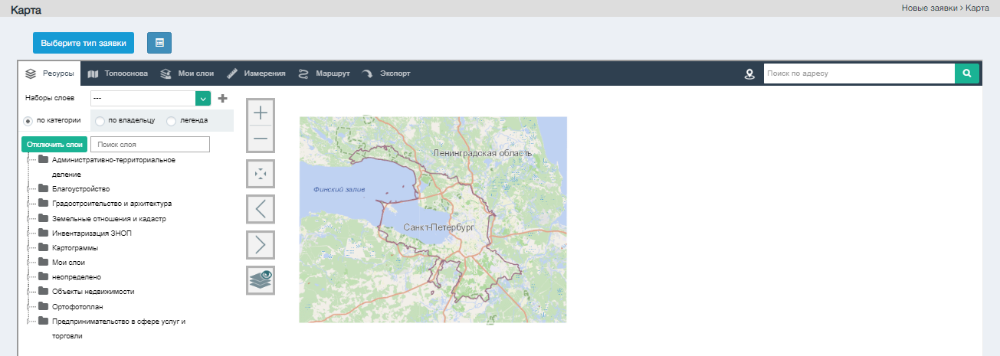
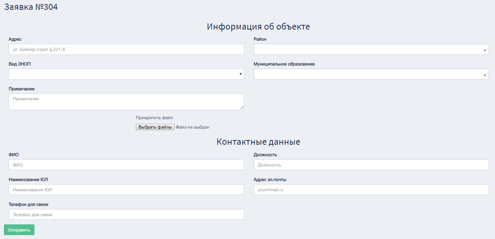
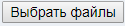

Экранная форма "Инвентаризация КИИ:Карта"

Управляющий элемент  позволяет выбрать тип заявки:

1. Включить в ЗНОП;
2. Исключить из ЗНОП;
3. Изменить статус ЗНОП;
4. Изменить границы ЗНОП.

Любой из четырех вариантов переместит пользователя в "Создание заявки".

Экранная форма "Создание заявки".  

Заполните необходимые поля верными данными, прикрепите нужные файлы с помощью управляющего элемента . После завершения всей действий нажмите на управляющий элемент 