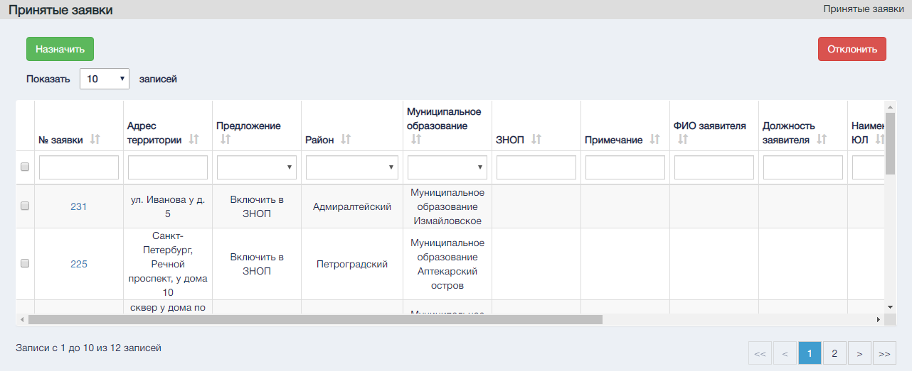
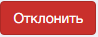
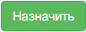

Экранная форма "Принятые заявки".  

Управляющие элементы раздела "Принятые заявки".

В шапке таблицы существуют текстовые поля для поиска и сортировки по отдельный столбцам, а так же выделение всех заявок.

#### Управляющие эелменты

| № п.п. | Графическое обозначение управляющего элемента/формы | Предназначение                                                                                                                                                           |
|--------|-----------------------------------------------------|--------------------------------------------------------------------------------------------------------------------------------------------------------------------------|
| 1      |                                          | Выбор определенных заявок                                                                                                                                                |
| 2      |                                       | Отклонение заявки с вводом причины отказа.                                                                                                                               |
| 3      |                                         | Изменяет количество выводимых на страницу записей. Варианты количества: 10, 20, 30, 40.                                                                                  |
| 4      |                                        | Переход на нужную страницу реестра.  Одинарная стрелка – переход на следующую и предыдущую страницы.  Двойная стрелка – переход на первую  и последнюю страницы реестра. |
| 5      |                                          | Назначение исполнителя                                                                                                                                                   |