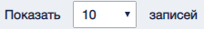

В разделе "Утвержденные заявки" можно переместить заявку в реест учета ОБ с помощью управляющего элемента .
В разделе  "Отклоненные заявки" можно восстановить необходиму заявку нажав на  или удалить навсегда спомошью управляющего элемента 

#### Общие упавляющие элементы

| №      | Графическое обозначение управляющего элемента/формы | Предназначение                                                                                                                                                           |
|--------|-----------------------------------------------------|--------------------------------------------------------------------------------------------------------------------------------------------------------------------------|
| 1      |                                          | Выбор определенных заявок                                                                                                                                                |
| 2      |                                         | Изменяет количество выводимых на страницу записей. Варианты количества: 10, 20, 30, 40.                                                                                  |
| 3      |                                        | Переход на нужную страницу реестра.  Одинарная стрелка – переход на следующую и предыдущую страницы.  Двойная стрелка – переход на первую  и последнюю страницы реестра. |