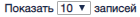
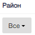
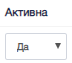

Раздел «Организации» предназначен для ведения информации об организациях, учета привязки организации к ОБ и ЭБ.

#### Управляющие элементы раздела «Организации»

| № | Графическое обозначение управляющего элемента | Предназначение                                                                                                                                                       |
|---|-----------------------------------------------|----------------------------------------------------------------------------------------------------------------------------------------------------------------------|
| 1 |                                   | Архивирование организации.                                                                                                                                           |
| 2 |                              | Переход к форме предоставления перечня объектов, ссылающихся на данную организацию.                                                                                  |
| 3 |                                  | Изменяет количество выводимых на страницу записей.  Варианты количества:10, 20, 30, 40.                                                                              |
| 4 |                                   | Переход на нужную страницу реестра.Одинарная стрелка – переход на следующую и предыдущую страницы. Двойная стрелка – переход на первую и последнюю страницы реестра. |
| 5 |                                | Информирует о количестве записей реестра с учетом примененных фильтров.                                                                                              |                                                                                                                                                                      |

Для удобного поиска необходимой организации были добвлены поиски по столбцам и реализован функционал комплексного поиска.

#### Поиски по столбцам

| № | Графическое обозначение управляющего элемента | Предназначение                                                                                   |
|---|-----------------------------------------------|--------------------------------------------------------------------------------------------------|
| 1 |                                  | Поиск по названию. Существует возможность сортировать в прямом и в обратном алфавитном порядке.  |
| 2 |                                   | Поиск по ИИН.                                                                                    |
| 3 |                                    | Поиск по районам. Есть возможность выбрать определенный список районов и "не определен".         |
| 4 |                                    | Поле для ручного ввода значений по наименованию родительской организации.                        |
| 5 |                                 | Поле для выбора значения активности из выпадающего списка.                                       |
