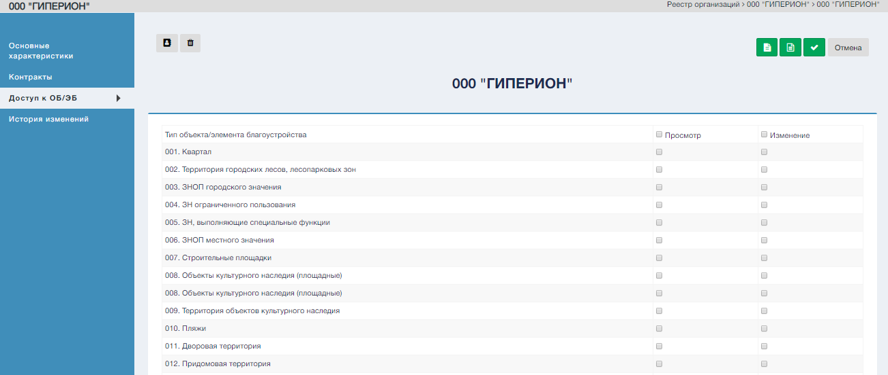

Раздел доступ к ОБ/ЭБ представляет редактируемый список из чек боксов
с перечнем типов ОБ/ЭБ.  

Для того, чтобы сотрудники выбранной организации, могли просматривать определенный тип ОБ/ЭБ, необходимо установить чек бокс соответствующего
типа ОБ/ЭБ в истинное положение.

Для того, чтобы сотрудники выбранной организации, не могли просматривать определенный тип ОБ/ЭБ, необходимо установить чек бокс соответствующего
типа ОБ/ЭБ в ложное положение.

Если в карточку организации не требуется вносить других изменений, то после внесения изменений в раздел «Доступ к ОБ/ЭБ» экранной формы редактирования карточки организации необходимо воспользоваться управляющим элементом  раздела «Доступ к ОБ/ЭБ» экранной формы редактирования карточки организации, предназначенный для сохранения внесенных изменений.

Измененные характеристики выбранной организации отобразятся в разделе «Доступ к ОБ/ЭБ» экранной формы редактирования карточки организации.