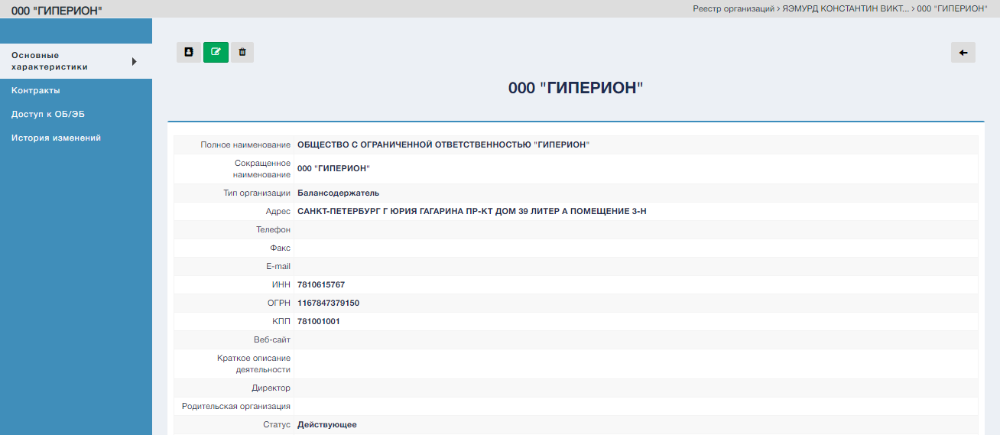
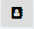
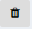
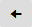

Экранная форма просмотра организации.  

Существуют разделы:  
1. Основные характеристики - Основные характеристики выбранной организации;
2. Конаркты - Перечень контрактов, заключенных выбранной организацией, на обслуживание ОБ/ЭБ;
3. Доступ к ОБ/ЭБ - Перечень типов ОБ/ЭБ доступных выбранной организации;
4. История изменений - Формируемая автоматически, на основании действий пользователей, история изменений информации об организациях.

#### Управляющие элементы экранной формы "Карточка организации"

| № | Графическое обозначение управляющего элемента | Предназначение                                      |
|---|-----------------------------------------------|-----------------------------------------------------|
| 1 |                                   | Переход в режим редактирования карточки организации |
| 2 |                            | Перечень сотрудников выбранной организации          |
| 3 |                                 | Удаление карточки организации                       |
| 4 |                                     | Переход в реестр организаций                        |