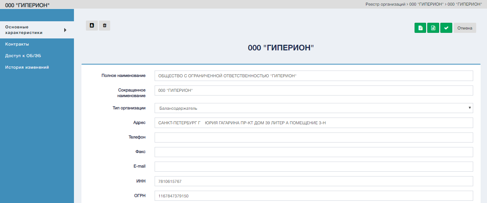
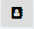
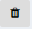
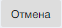

Для перехода в режим редактирования карточки организации воспользоваться управляющим элементом . Система откроет экранную форму редактирования карточки организации. По умолчанию откроется раздел «Основные характеристики».

Экранная форма редактирования карточки организации.  

#### Управляюие элементы редактирования карточки учета

| № | Графическое обозначение управляющего элемента | Предназначение                                                                    |
|---|-----------------------------------------------|-----------------------------------------------------------------------------------|
| 1 |                            | Перечень сотрудников выбранной организации                                        |
| 2 |                                 | Удаление карточки организации.                                                    |
| 3 |                           | Переход в режим создания нового государственного контракта выбранной организации. |
| 4 |                              | Переход в режим создания нового субподрядного договора выбранной организации.     |
| 5 |                                  | Сохранение отредактированной карточки организации и переход в реестр организаций. |
| 6 |                                | Переход в реестр организаций.                                                     |