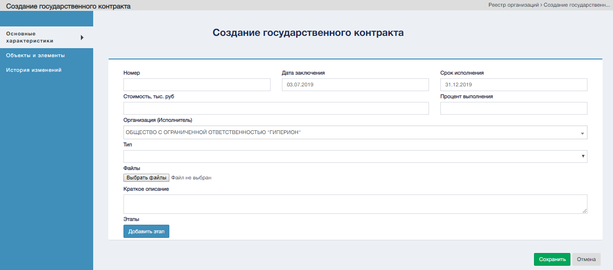

Экранная форма создния государственного контракта.  

#### Список разделов создания государственного контракта

1. Основные характеристики - основополагающие характеристики гос., контракта;
2. Объекты и элементы - объекты и элементы входящие в контракт;
3. История изменений - Формируемая автоматически, на основании действий пользователей, история изменений информации об организациях.

#### Управляющие элементы создания государственного контракта

| № | Графическое обозначение управляющего элемента | Предназначение                                                                                 |
|---|-----------------------------------------------|------------------------------------------------------------------------------------------------|
| 1 |                               | Добавляет характеристики этапа. Можно использовать повторно для добавление n количества этапов |
| 2 |                             | Удаление выбранного этапа                                                                      |
| 3 |                               | Добавление файла к контракту                                                                   |
| 4 |                            | Сохранение контракта                                                                           |
| 5 |                                | Отмена всех действий                                                                           |