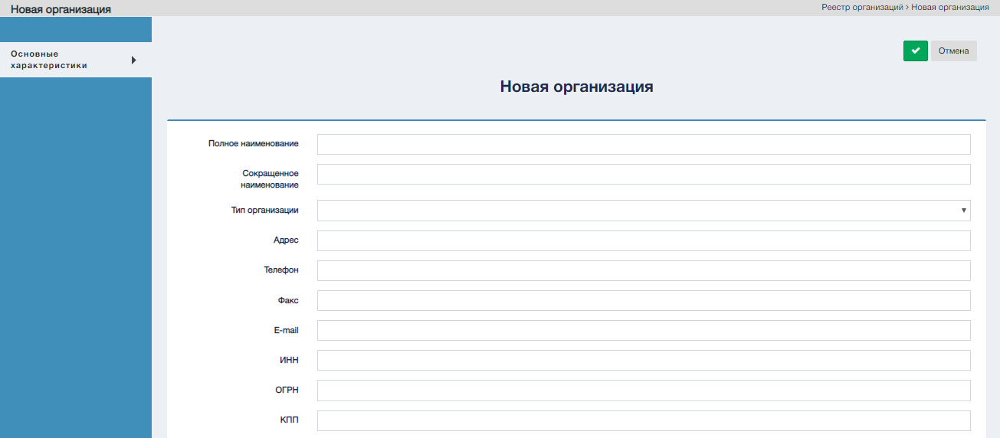

Для начала создания организации нажмите на управляющий элемент "Добавить организацию" .

Режим cоздания организации представлен ниже. 

Заполните необходимые поля после чего нажмите на элемент .

#### Управляющие элементы 

| № | Графическое обозначение управляющего элемента | Предназначение                       |
|---|-----------------------------------------------|--------------------------------------|
| 1 |                                | Создать организацию                  |
| 2 |                               | Сохранить организацию                |
| 3 |                                | Выйти из режима создания организации |