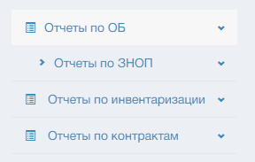
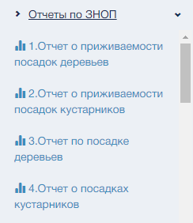
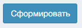
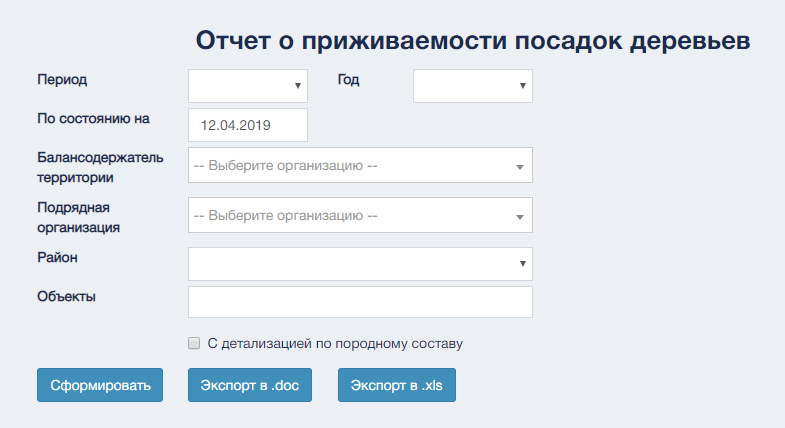
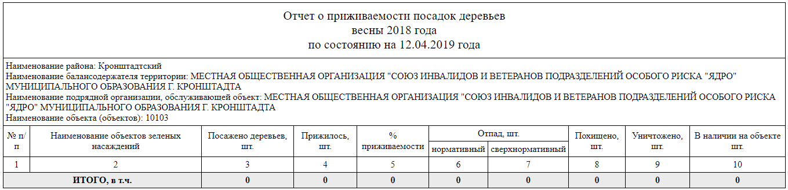
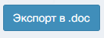
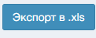

Раздел «Отчетность» предназначен для автоматической генерации отчетов
на основании данных, имеющихся на Портале.

Раздел «Отчетность» предназначен для автоматической генерации отчетов
на основании данных, имеющихся на Портале.
Стартовая страница раздела главного меню «Отчетность» представляет собой боковое выпадающее меню с видами отчетов  

Для формирования отчета кликнуть по пункту бокового меню и выбрать нужный отчет  

Заполнить предложенные поля необходимыми значениями и воспользоваться управляющим элементом сформировать.   

 Система перенаправит к форме предварительного просмотра отчета.  
  

Воспользоваться управляющим элементом   для сохранения отчета
в виде файла формата .doc используя "Экспорт в .doc"   или .xls используя "Экспорт в .xls" .