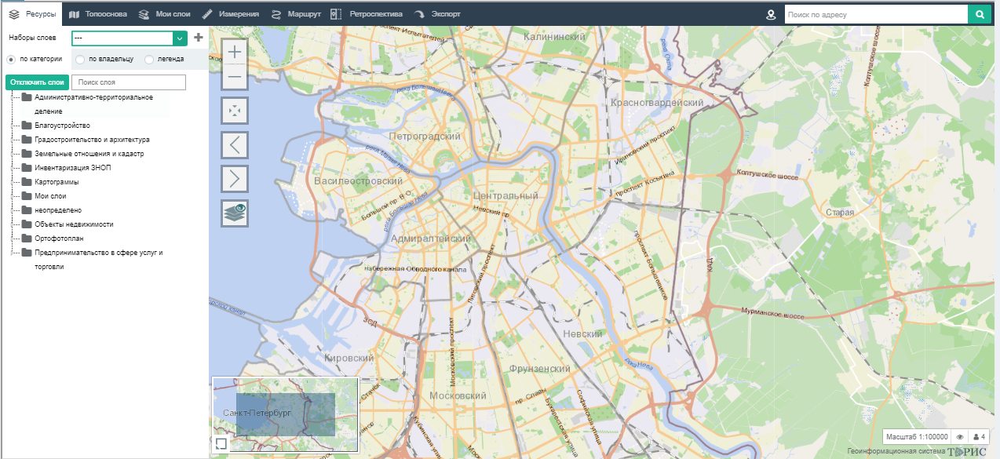

Раздел «Карта» предназначен для графического отображения геометрии ОБ и ЭБ.

Экранная форма раздела «Карта» состоит из следующих частей:

1. Рабочая область карты

2. Ресурсы, различные слои, с помощью которых можно поучить информацию о группе объектов на карте  

3. Топооснова, изменения вида карты или для перехода на другие сервисы  

4. Мои слои, cписок созданных слоев пользователем  

5. Измерения, инструменты для измерения созданной площади  

6. Маршрут, cоздание маршрута на карте  

7. Ретроспектива, сравнение двух разных слоев  

8. Экспорт, создание и редактирование фотографии карты для дальнейшего скачивания или печати  

