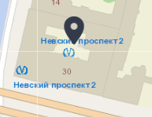

Работа с поиском осуществляется посредством ввода текста в поле для поиска.  

Система на выбор может предоставить несколько адресов, максимально похожих на вводимый как показано ниже  

После выбора определенного адреса произойдет позиционирование выбранного объекта на карте  
