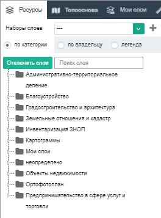
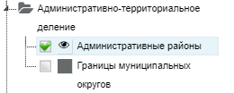
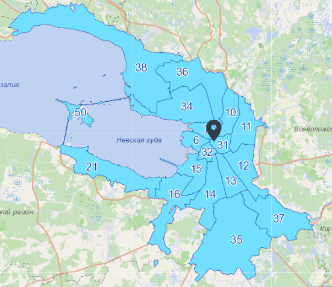

В разделе "Карта" необходимо выбрать элемент "Ресурсы", Система откроет окно выбора картографических слоев  

В окне выбора картографического слоя можно выбрать вид сортировки слоев  

После чего есть возможность воспользоваться управляющим элементом раскрытия иерархического дерева и использовать отметки для выбора слоя  

После всех шагов выбранный слой отобразится на карте  

