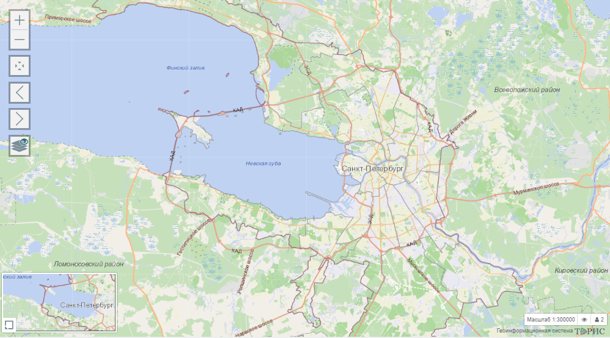
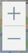
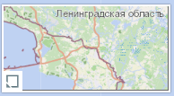

 Рабочая область карты состоит из наборов инструментов и картой города	.

 Список инструментов:

1. Приближение и удаление карты  

2. Установление размера карты в масштаб 1:300000  

3. Вернуть предыдущий вид  

4. Установить следующий вид  

5. Сквозная идентификация  

 
6. Мини-Карта расположенная в левом нижнем углу экрана, которую можно свернуть нажав на кнопку   

