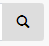
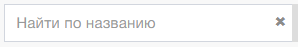
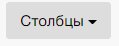
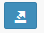

Панель инструментов раздела «Архив» включает в себя управляющие элементы и формы:

1. Форма «Поиск» и управляющий элемент «Начать поиск».     
  

2. Управляющий элемент «Столбцы» - Переход в окно выбора набора столбцов реестра  

3. Управляющий элемент «Экспорт» - Экспорт реестра  

4. Управляющий элемент «Меню» - Переход к меню фильтров  

5. Объектами и Элементамы - Предназначены для отображения в списке только объектов или только элементов.
