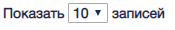
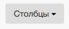
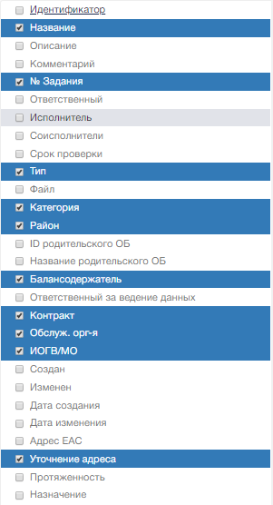
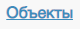
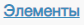

Основная рабочая область экранной формы реестра «Архивные» и «Не активные» включает
в себя управляющие элементы.

1. Управляющий элемент изменения количества выводимых
на страницу записей.Изменяет количество выводимых
на страницу записей.
Варианты количества:
10, 20, 30, 40.  
  

2. Управляющий элемент перехода
по страницам реестра  

3. Информационный элемент «Количество станиц и объектов реестра»  

4. Управляющий элемент «Столбцы».  
Переход в окно выбора набора столбцов реестра.  

5.	Управляющий элемент "Объекты". Создан для вывода всех объектов.  

6. Управляющий элемент "Элементы". Создан для вывода всех элементов.  

