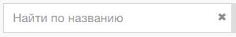

 
Панель инструментов реестра «Камеральная проверка» включает в себя управляющие элементы и формы :

1. Форма «Поиск по названию» 
 и управляющий элемент «Начать поиск»   

2. Управляющий элемент «Столбцы» . Переход в окно выбора набора столбцов реестра.  

3. Управляющий элемент «Экспорт». Выгрузка данных в формате .xls.  

4. Управляющий элемент «Назначить на проверку». Переход к окну назначения ОБ в задания на проверку. Доступен только для ответственного за камеральную проверку от ИОГВ. Доступен только из реестра Камеральной проверки.  
