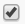
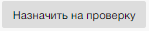
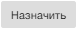

Перед назначением проверки необходимо выбрать объект или элемент с помощью элемента , находящегося в первом столбце.  
В результате нажатия на управляющий элемент  появится экранная форма предсавленная ниже.  

Заполнив поля необходимо нажать на управляющий элемент .