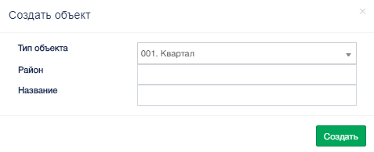
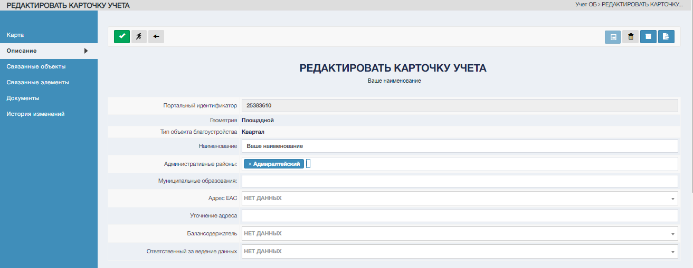

Воспользуйтесь управляющим элементом на панели управления раздела «Учет ОБ»  

Система откроет окно «Создать объект».  

После заполнения полей нажмите "Создать"  

Система откроет Карточку учета в режиме редактирования.

По умолчанию заполнены характеристики, введенные в окне создания объекта.