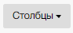
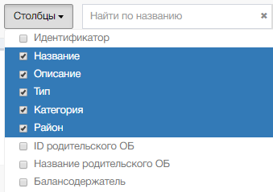

Набор столбцов определяется с помощью управляющего элемента «Столбцы» на панели инструментов  

Для отображения перечня столбцов нужно кликнуть по кнопке «Столбцы». Система откроет окно выбора столбцов

