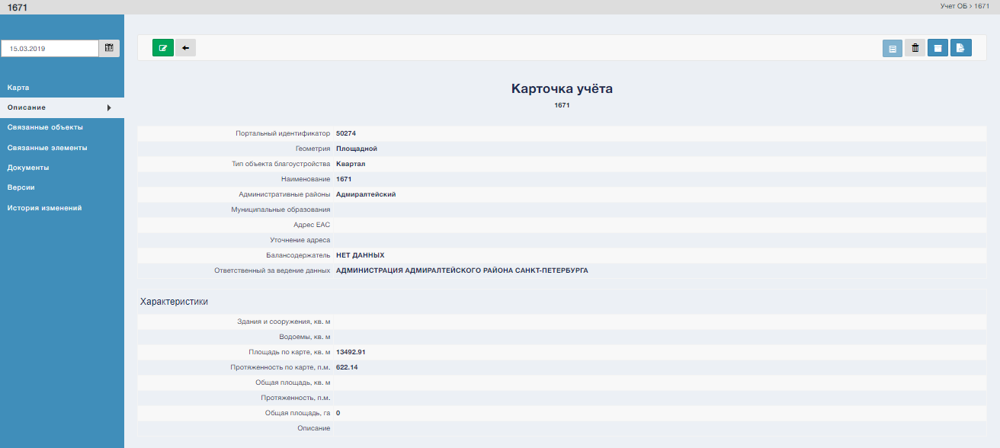
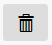
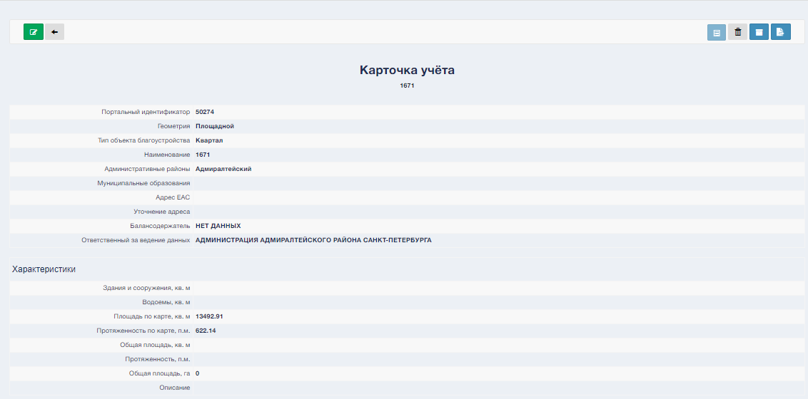
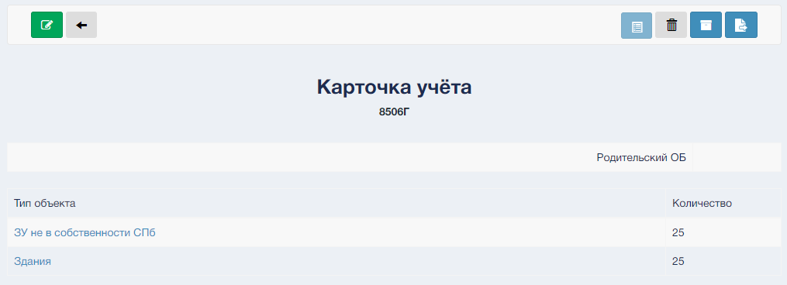
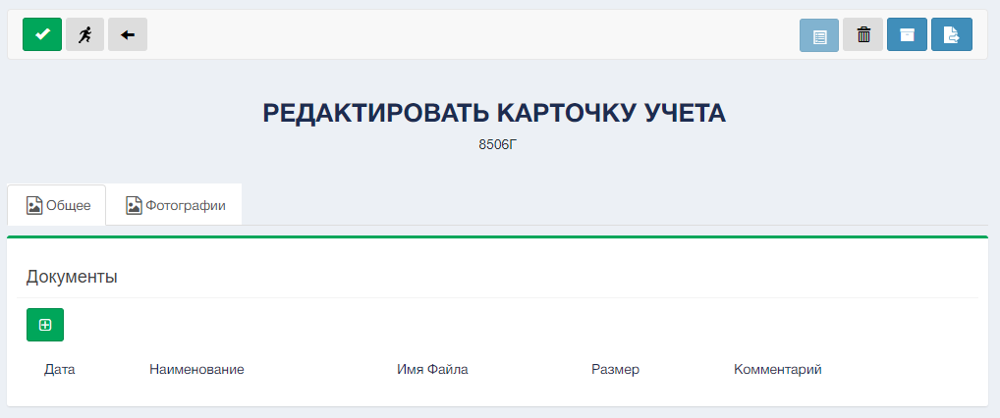
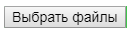
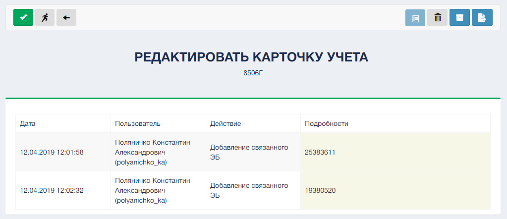

При входе в реестр ОБ есть возможность просмотра карточки объекта, для этого необходимо нажать на портальный идентификатор ОБ. После чего произойдет переход.  

Функционал Карточки учета:  
1. кнопка  "Редактировать" (смотри "Редактирование карточки учета ОБ")  
  
2. кнопка "Назад", переход в реестр ОБ  
	 
3. кнопка "Деактивировать"  
  
4. кнопка "Архивировать"  
  
5. кнопка "Экспорт карточки учета"  

 Меню карточки учета содержит следующие элементы:

1. Карта
	По функционалу аналогично разделу "Карта"

2. Описание, содержит характеристик объекта.

	
3. Связанные объекты с данным.  

5. Документы, загруженные в карточку учета.  

Для добавления документ нажмите кнопку "Добавить документ" , затем выберите необходимый файл  и нажмите кнопку "Загрузить" 

6. История изменений, содержит хронологию редактирования данной карточки.  
