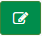
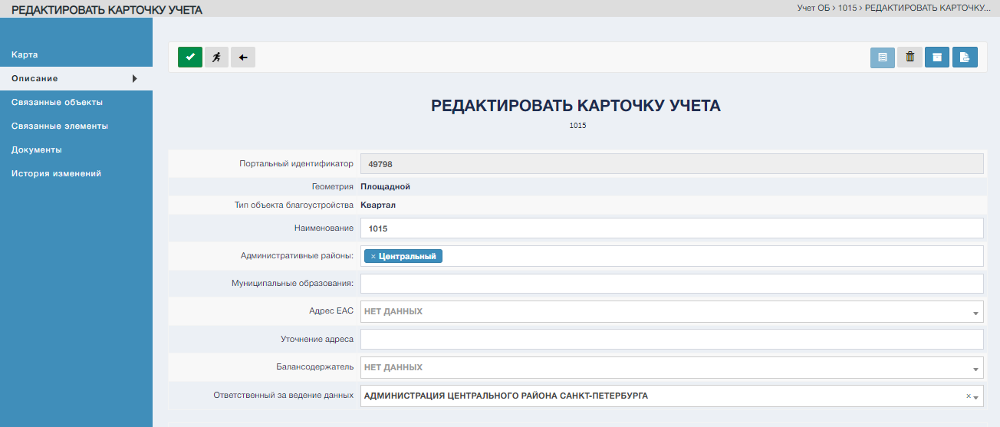
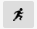
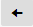
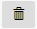
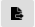
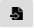

Для перехода в режим редактирования карточки учета ОБ воспользоваться управляющим элементом "Редактировать" .

Система откроет экранную форму «Карточка учета ОБ на редактирование». По умолчанию откроется раздел «Описание».  

Для редактирования доступны следующие разделы карточки учета:"Карта", "Описание", "Связанные объекты", "Связанные элементы", "Документы", "История изменений".

### Изменение характеристик выбранного ОБ. Раздел «Описание»

При переходе в режим редактирования карточки учета ОБ по умолчанию открывается раздел «Описание». Характеристики ОБ, которые можно исправить в карточке учета ОБ, представлены как редактируемые поля.

#### Список редактируемых полей.
1. "Наименнование";
2. "Административные районы";
3. "Муниципальные образования";
4. "Адрес ЕАС";
5. "Уточнение адреса";
6. "Балансодержатель";
7. "Ответственный за ведение данных".

#### Характеристики

Характеристики содержат числовые данные об объекте, такие как квадратные метры и погонные метр.

#### Управляющие элементы в "Редактировании ОБ"

| №        | Графическое обозначение управляющего элемента | Предназначение                                                     |
|----------|-----------------------------------------------|--------------------------------------------------------------------|
| 1.       |                                  | Сохранение внесенных изменений.                                    |
| 2.       |                                   | Переход в режим просмотра карточки учета ОБ.                       |
| 3.       |                                     | Переход в раздел «Учет ОБ» в подраздел «Реестр».                   |
| 4.       |                               | Деактивация карточки (перевод карточки в реестр «Не активные»).    |
| 5.       |                                 | Архивация карточки (перевод карточкив реестр «Архивные»).          |
| 6.       |                                 | Переход к окну добавления связанного ОБ.                           |
| 7.       |                              | Переход к окну создания нового связанного ОБ.                      |
| 8.       |                               | Экспорт в .xls. Доступен только для ОБ типа «003. ЗНОП»            |
| 9.       |                                | Импорт из .xls. Доступен только для ОБ типа «003. ЗНОП»            |