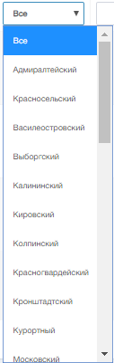

Для фильтрации записей в таблице предусмотрены следующие инструменты 

1. Текстовый поиск  
  
Поле для ручного ввода значений. По мере ввода значения в полях производится текстовый поиск.

2. Выбор значения из представленных  

3. Сортировка по столбцам осуществляется нажатием на название столбца, после чего появляется стрелка, характеризующая сортировку возрастания
 или убывания 