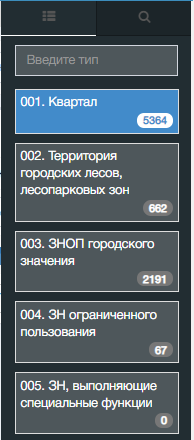
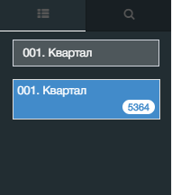
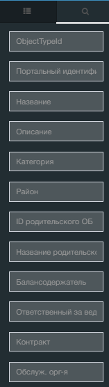

Фильтрация по типу ОБ осуществляется с помощью управляющего элемента «Меню» в шапке Портала
(правый верхний угол)  

Для выбора типа ОБ – кликните на управляющий элемент, система откроет дополнительное меню.  

### Пример:

Результаты фильтрации реестра по типу ОБ «001. Квартал»  

Так же существует комплексный поиск по всем существующим столбцам.  
