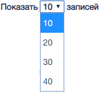
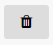
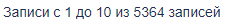

1. Изменяет количество выводимых на страницу записей.  

2. Управляющий элемент перехода
по страницам реестра  

3. Управляющий элемент «Деактивировать ОБ». Деактивирует карточку учета ОБ, при этом статус объекта становится
«Не активен».  

4. Управляющий элемент «Архив». 	
Помещает карточку учета ОБ в Архив.  

5. Информационный элемент. Информирует
о количестве объектов и страниц реестра
с учетом примененных фильтров  
