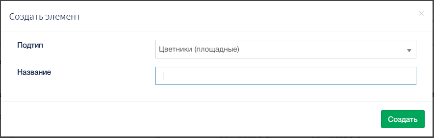
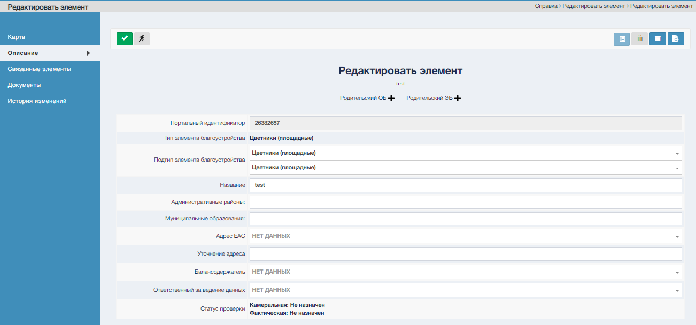
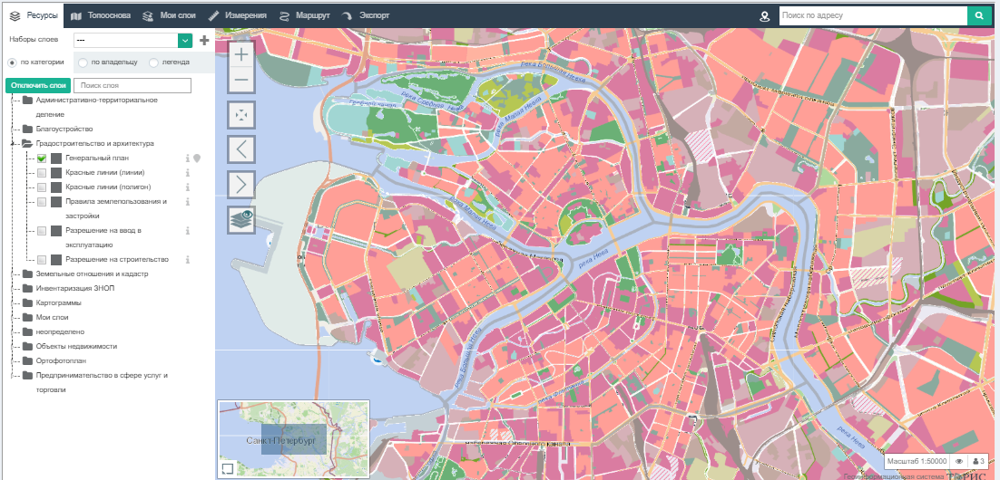
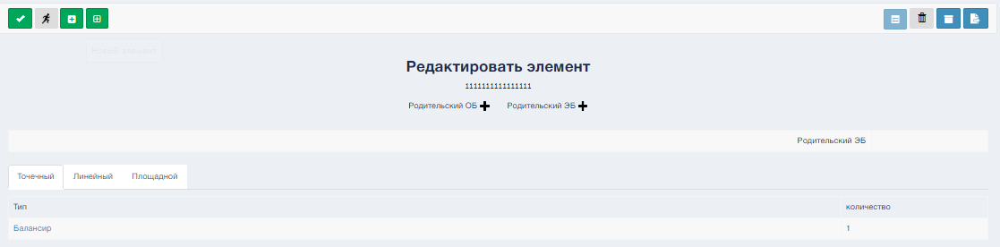
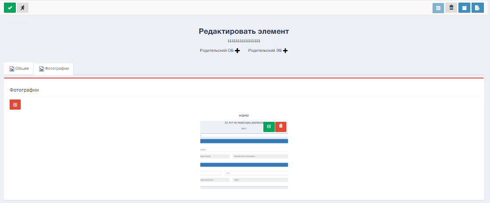

Для того, чтобы добавить ЭБ, необходимо воспользоваться управляющим элементом  на панели управления раздела «Учет ЭБ» 

В результате появиться окно в котором необходимо ввести Подтип и Название.  

В результате заполнения пользователь переместиться в Редактирование элементов.  

В режиме редактирования элемента доступны следующие разделы:  
1. Карта;  
2. Описание;  
3. Связанные элементы;  
4. Документы;  
5. История изменений.  

# Карта  
Отображение геометрии выбранного ЭБ на карте ГеоАС ТОРИС..  

# Описание  
Описание содержит характеризующую информацию об редактируемом ЭБ такую как портальный идентификатор, название, муниципальные образования.

# Свойства  
Дополнительные характеристики ЭБ. Доступны только для ЭБ типа «605. УО»

# Связанные элементы  
Отображает связанные элементы трех типов, а именно точечный, линейный, площадной.  

# Документы  
Перечень документов, прикрепленных к карточке учета выбранного ЭБ.

Для загрузки документов испоьзуйте  после чего заполните в появившимся окне необходимую информацию и выберите нужный файл.	

# История изменений  
Содержит информацию об изменений ЭБ.
