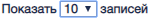

## Инструменты в Учет ЭБ

| Изображение        | Назначение                         |
|--------------------|------------------------------------|
|        | Элемент добавляющий ЭБ             |
|    | Элемент подготавливающий учет ЭБ.  |
|      | Элемент отвечающий за удаление ЭБ. |
|        | Перенос ЭБ в архив.                |
|    | Выбор отображаемых столбцов        |
|     | Форма для поиска записей           |
|  | Управление страницами              |
|       | Показ записей на 1 странице        |

## Инстременты в редактирование элемента

| Изображение          | Назначение                                    |
|----------------------|-----------------------------------------------|
|        | Сохранение редактирования                     |
|          | Переход в режим просмотра                     |
|      | Экспорт файла в .xls (только для ЭБ типа 605) |
|       | Импорт файла в .xls (только для ЭБ типа 605)  |
|  | Импорт карточки в .xls                        |
|      | Деактивация карточки учета                    |
|       | Восстановление карточки учета                 |
|      | Редактировать карточку учета                  |
|  | добавление документа                          |
|       | добавление изображения                        |
|       | добавление родительского ОБ                   |
|       | добавление родительского ЭБ                   |

